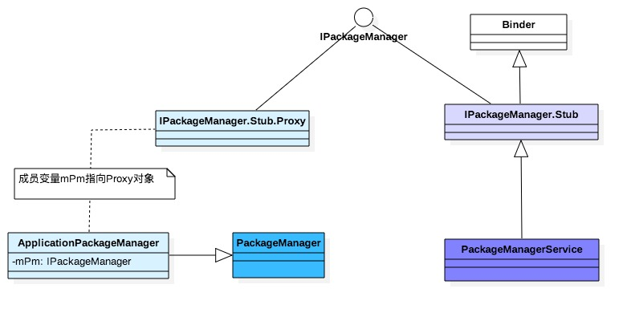

# PackageManagerService
# 概述
PakageManagerService (简称 PMS)，是 Android 核心服务之一，管理着所有 package 相关的工作。
- 安装、卸载应用
- 查询、增加、删除 permission 相关信息
- 查询 Application 相关信息
- 查询已安装应用
- 清除用户数据，缓存
# 相关类分析
PMS 是通过 Binder 进行通信。IPackageManager.aidl 通过工具生成 Binder 的服务端 IPackageManager.Stub 和
客户端 IPackageManager.Stub.Proxy，编译后生成的路径在 out/target/common 目录下。
Binder 服务端：PackageManagerService 继承于 IPackageManager.Stub
Binder 客户端：ApplicationPackageManager（简称APM）的成员变量 mPM 继承于 IPackageManager.Stub.Proxy;
 APM 继承于 PakageManager 对象




**PackageManagerService**
1. 创建Settings对象；
2. 将8类shareUserId到mSettings；
3. 初始化SystemConfig；
4. 创建名为“PackageManager”的handler线程mHandlerThread;
5. 创建UserManagerService、PermissionManagerService服务；
6. 通过解析目录中的xmL文件构造共享mSharedLibraries；

**Settings**

创建系统文件夹，一些包管理的文件。
packages.xml、packages-backup.xml是一组，用于描述系统所安装的 Package 信息，其中 packages-backup.xml 是 packages.xml 的备份
packages.list 用于描述系统中存在的所有非系统自带的 apk 信息以及 UID 大于 10000 的 apk。当 APK 有变化时，PMS 就会更新该文件。

**PackageParser**

解析apk安装包，它能解析单一apk文件，也能够解析multiple APKs（一个apk文件里面包含多个apk文件）。这些multiple APKs需要满足下面几个条件：
1. 所有的apk必须具有完全相同的软件包包名，版本代码和签名证书
2. 所有的apk必须具有唯一的拆分名称
3. 所有安装必须含有一个单一的apk

解析步骤
1. 将apk解析成package
2. 将package转化为packageinfo

**Installer**
协助安装的过程，操作基本上是在 cpp 里面，真正的工作是由 installd 执行，installd 通过 Native Binder 实现

**PackageManagerInternal（PackageManagerInternalImpl）**
用于系统内部 SystemServer 的 packagemanager

**UserManagerService**
用户管理服务

**PermissionManagerService**
权限管理服务

**SystemConfig**

通过readPermissions函数将对应目录下的xml文件中定义的各个节点读取出来保存到SystemConfig成员变量中
PackageHandler
handler 线程，主要工作是程序 安装 和 卸载 等
FallbackCategoryProvider
将framework-res.apk添加到AssetManager
# PMS 启动
在 SystemServer 启动过程中，PMS 最主要的操作如下：
- PMS.main() 启动PackagemanagerService服务
- PMS.updatePackagesIfNeeded() 对应用 dexopt 的顺序进行排序，并执行 dexopt 操作
- PMS.systemReady() 通知系统进入就绪状态
```java
class SystemServer {
    private PackageManagerService mPackageManagerService;
    private PackageManager mPackageManager;
    private void run() {
        ...
        startBootstrapServices();
        startOtherServices();
        ...
    }
    void startBootstrapServices(){
        // 启动installer服务，PMS相关任务的执行者
        Installer installer = mSystemServiceManager.startService(Installer.class);
        ......
        // 启动PackagemanagerService服务
        mPackageManagerService = PackageManagerService.main(mSystemContext, installer, mFactoryTestMode != FactoryTest.FACTORY_TEST_OFF, mOnlyCore);
        //是否是开机后第一次启动
        mFirstBoot = mPackageManagerService.isFirstBoot();
        //获取包管理
        mPackageManager = mSystemContext.getPackageManager();
    }
    void startOtherServices() {
        if (!mOnlyCore) {
            // dexopt 是 android 上 Java 字节码的一种优化技术，可提高运行效率
            // 对应用 dexopt 的顺序进行排序，并执行 dexopt 操作
            mPackageManagerService.updatePackagesIfNeeded();
        }
        // 当 3 天未执行 fstrim 时，则执行 fstrim 操作
        mPackageManagerService.performFstrimIfNeeded();
        ......
        /**
         * 通知系统进入就绪状态
         * 系统初始化完成并且 PMS 也初始化完成， PMS 需要进行的操作，如通知其他服务执行systemReady操作
         */
        mPackageManagerService.systemReady();
        ......
        // 等待mPrepareAppDataFuture多线程的任务都处理完成
        mPackageManagerService.waitForAppDataPrepared();
    }
}
```
## PMS.main
main 方法主要功能是创建 PMS 对象，创建 PMS 对象的执行时间比较长，在其构造函数做了很多的“重力活”，这也是Android启动慢的原因之一。

构造函数的主要功能是扫描 Android 系统中目标文件夹中的 APK，从而建立合适的数据结构来管理诸如：Package 信息，四大组件、权限等各种信息

PMS 工作流程相对简单，复杂的是其中用于保存各种信息的数据结构以及它们之间的关系。 PMS 构造函数主要分为五个阶段，每个阶段都会输出日志到EventLog，除了阶段1的开始部分代码，后面的代码都同时持有同步锁mPackage、mInstallLock。

  1. PMS_START（启动初始化阶段，显示屏幕相关、用户管理服务、权限管理服务等）
  2. PMS_SYSTEM_SCAN_START（扫描系统 apk ，system、vendor、product、odm、oem 的 priv-app 和 app 目录下的 apk 文件）
  3. PMS_DATA_SCAN_START（扫描 data 分区的 apk，/data/app、/data/app-private）
  4. PMS_SCAN_END（结束阶段，更新权限、为系统应用准备空间和数据）
  5. PMS_READY（ready 阶段，创建PackageInstallerService服务）
```java
class PackageManagerService{
    public static PackageManagerService main(Context context, Installer installer, boolean factoryTest, boolean onlyCore) {
        ......
        PackageManagerService m = new PackageManagerService(context, installer, factoryTest, onlyCore);
        // 注册 pms 到 ServiceManager 中
        ServiceManager.addService("package", m);
        final PackageManagerNative pmn = m.new PackageManagerNative();
        ServiceManager.addService("package_native", pmn);
        return m;
    }
    public PackageManagerService(Context context, Installer installer, boolean factoryTest, boolean onlyCore) {
        // 1. 启动初始化阶段
        EventLog.writeEvent(EventLogTags.BOOT_PROGRESS_PMS_START,SystemClock.uptimeMillis());
        synchronized (mInstallLock) {
            synchronized (mPackages) {
                LocalServices.addService(
                    PackageManagerInternal.class, new PackageManagerInternalImpl()
                );
                sUserManager = new UserManagerService(context, this,new UserDataPreparer(mInstaller, mInstallLock, mContext, mOnlyCore), mPackages);
                mComponentResolver = new ComponentResolver(sUserManager, LocalServices.getService(PackageManagerInternal.class), mPackages);
                mPermissionManager = PermissionManagerService.create(context, mPackages /*externalLock*/);
                mDefaultPermissionPolicy = mPermissionManager.getDefaultPermissionGrantPolicy();
                mSettings = new Settings(Environment.getDataDirectory(), mPermissionManager.getPermissionSettings(), mPackages);
            }
        }
        // 2. 扫描系统 apk 
        // /system/frameworks、/system/priv-app、/system/app
        // /vendor/overlay、/vendor/priv-app、/vendor/app、
        // /product/overlay、/product/priv-app、/product/app
        // /product_services/priv-app、/product_services/app
        // /odm/priv-app、/odm/app
        // /oem/app
        EventLog.writeEvent(EventLogTags.BOOT_PROGRESS_PMS_SYSTEM_SCAN_START,startTime);
        ......
        scanDirTracedLI(frameworkDir, mDefParseFlags | PackageParser.PARSE_IS_SYSTEM_DIR,
            scanFlags | SCAN_NO_DEX | SCAN_AS_SYSTEM | SCAN_AS_PRIVILEGED, 0);
        ......
        // 3. 扫描 data 分区的 apk
        EventLog.writeEvent(EventLogTags.BOOT_PROGRESS_PMS_DATA_SCAN_START,SystemClock.uptimeMillis());
        //扫描 /data/app目录
        scanDirTracedLI(sAppInstallDir, 0, scanFlags | SCAN_REQUIRE_KNOWN, 0);
        //扫描 /data/app-private目录
        scanDirTracedLI(sDrmAppPrivateInstallDir, mDefParseFlags | PackageParser.PARSE_FORWARD_LOCK,
             scanFlags | SCAN_REQUIRE_KNOWN, 0);
        //解压安装备份的系统应用，确保备份的系统应用被更新
        decompressSystemApplications(stubSystemApps, scanFlags);
        //获取存储管理包名
        mStorageManagerPackage = getStorageManagerPackageName();
        //更新所有应用的动态库路径
        updateAllSharedLibrariesLPw(null);
        // 4. 结束阶段
        // 更新所有权限、为系统应用准备空间和数据、将上述信息写回/data/system/packages.xml
        EventLog.writeEvent(EventLogTags.BOOT_PROGRESS_PMS_SCAN_END, SystemClock.uptimeMillis());
        // 为系统应用准备空间和数据 
        List<String> deferPackages = reconcileAppsDataLI(StorageManager.UUID_PRIVATE_INTERNAL, UserHandle.USER_SYSTEM, storageFlags, true /* migrateAppData */,true /* onlyCoreApps */);
        // 把Settings的内容保存到packages.xml中
        mSettings.writeLPr();
        // 5. ready 阶段
        // 主要工作是创建PackageInstallerService服务
        EventLog.writeEvent(EventLogTags.BOOT_PROGRESS_PMS_READY, SystemClock.uptimeMillis());
        //启动PackageInstallerService服务
        mInstallerService = new PackageInstallerService(context, this);
        //初始化 installer activity
        updateInstantAppInstallerLocked(null);
    }
    private class PackageManagerNative extends IPackageManagerNative.Stub {
        public [object] funName(args) throws RemoteException {
            // call PMS method
            [object] result = PackageManagerService.this.funName(args)
            return result 
        }
    }
    private class PackageManagerInternalImpl extends PackageManagerInternal {
        public [object] funName(args) throws RemoteException {
            // call PMS method
            [object] result = PackageManagerService.this.funName(args)
            return result 
        }
    }
}
```


# 相关文档：

[PMS启动 APK 安装流程详解](https://blog.csdn.net/tianzhaoai/article/details/102842692?spm=1001.2014.3001.5502)


[PackageManagerService启动流程分析](https://skytoby.github.io/2019/PackageManagerService%E5%90%AF%E5%8A%A8%E6%B5%81%E7%A8%8B%E5%88%86%E6%9E%90/)

[installd守护进程](https://skytoby.github.io/2019/installd%E5%AE%88%E6%8A%A4%E8%BF%9B%E7%A8%8B/)