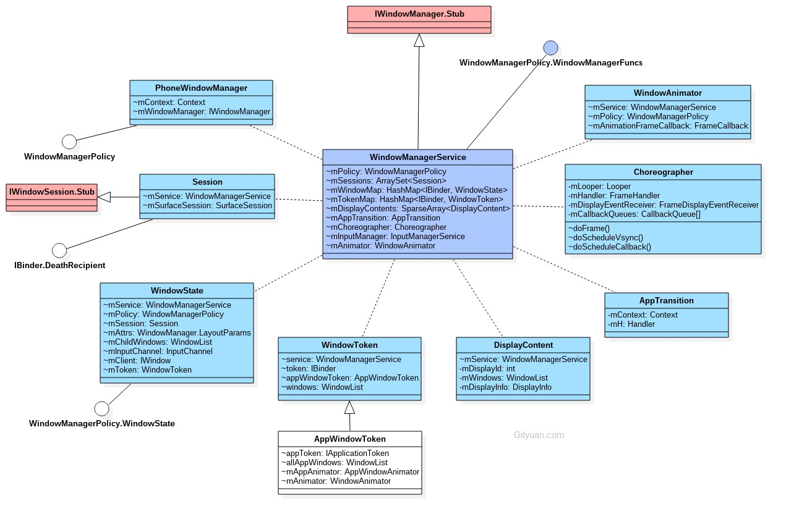
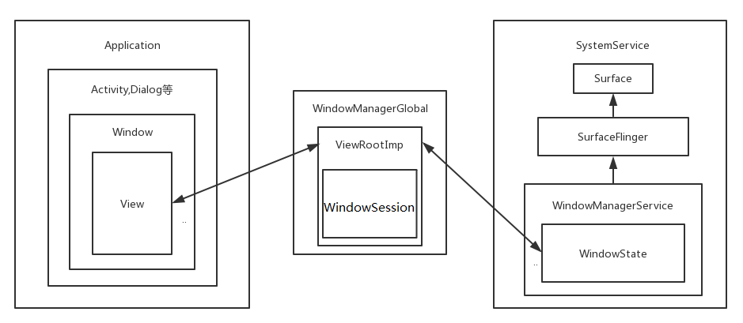
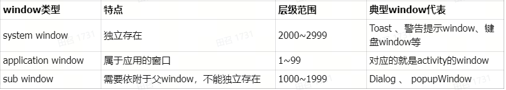

# WindowManagerService

# 概述
WindowManagerService作为Android系统中重要的服务，管理所有的窗口和输入事件的中转站

# 相关类
WMS继承于IWindowManager.Stub,作为Binder服务端

成员变量mSessions保存所有的Session对象，Session继承于IWindowSession.Stub，作为Binder服务端

成员变量mPolicy，实例是PhoneWindowManager，用于实现各种窗口相关的策略

成员变量mWindowMap,保存所有的WindowState对象;以IBinder为key, 是IWindow的Bp端;

每个窗口都对应一个WindowState对象, 该对象的成员变量mClient用于跟应用端交互,成员变量mToken用于跟AMS交互,WindowState的attach方法与SurfaceFlinger通信。

WindowManager与WindowManagerService通过Session进行通信，具体的实现由WMS处理。

WindowManager实现类是WindowManagerImpl ；

WindowManagerImpl 中成员变量 mParentWindow （Window）,mGlobal (WindowManagerGlobal)





### Activity 、Window和View间的关系
- Activity：本身不是窗口，也不是视图，它只是窗口的载体，一方面是key、touch事件的响应处理，一方面是对界面生命周期做统一调度。
- Window: 一个顶级窗口查看和行为的一个抽象基类。它也是装载View的原始容器， 处理一些应用窗口通用的逻辑。使用时用到的是它的唯一实现类：PhoneWindow。Window受WindowManager统一管理。
- DecorView: 顶级视图，一般情况下它内部会包含一个竖直方向的LinearLayout，上面的标题栏(titleBar)，下面是内容栏。通常我们在Activity中通过setContentView所设置的布局文件就是被加载到id为android.R.id.content的内容栏里(FrameLayout)。
  
window的类型较多，具体可见WindowManager的LayoutParams，这里给出几个比较重要的类型：




# 启动流程
```java
class SystemServer {
    void run(){
        startOtherServices();
    }
    private void startOtherServices() {
        WindowManagerService wm = null;
        // 创建 WMS
        wm = WindowManagerService.main(context, inputManager, !mFirstBoot, mOnlyCore,
                new PhoneWindowManager(), mActivityManagerService.mActivityTaskManager);
        ServiceManager.addService(Context.WINDOW_SERVICE, wm, /* allowIsolated= */ false,
                DUMP_FLAG_PRIORITY_CRITICAL | DUMP_FLAG_PROTO);
        // 绑定 wms 与 ams
        mActivityManagerService.setWindowManager(wm);
        // 绑定完成后，主要初始化 PhoneWindowManager
        wm.onInitReady();
        wm.displayReady();
        statusBar = new StatusBarManagerService(context, wm);
        wm.systemReady();
        final WindowManagerService windowManagerF = wm;
        mActivityManagerService.systemReady(() -> {
            /**
             * 启动系统 ui
             * SystemUI 是系统应用，其实就是 Android 系统上常见下拉面板，除了通知栏还有很多组件例如快捷键、电量等组件等也是在 SystemUI 中展示
             * 常见 UI 组件有
             * 状态栏 {@link com.android.systemui.statusbar.phone.StatusBar}
             * 导航栏 {@link com.android.setupwizardlib.view.NavigationBar}
             * 通知栏 {@link com.android.systemui.util.NotificationChannels}
             * 快捷按键栏 {@link com.android.systemui.qs.QSPanel}
             * 最近任务 {@link com.android.systemui.recents.Recents}
             * 键盘锁 {@link com.android.systemui.statusbar.phone.KeyguardBouncer}
             */
            startSystemUi(context, windowManagerF);
        })
    }
    void startSystemUi(Context context, WindowManagerService windowManager) {
        Intent intent = new Intent();
        intent.setComponent(new ComponentName("com.android.systemui",
                "com.android.systemui.SystemUIService"));
        intent.addFlags(Intent.FLAG_DEBUG_TRIAGED_MISSING);
        //Slog.d(TAG, "Starting service: " + intent);
        context.startServiceAsUser(intent, UserHandle.SYSTEM);
        windowManager.onSystemUiStarted();
    }
}
```
# 初始化
```java
class WindowManagerService {
    public static WindowManagerService main(final Context context, final InputManagerService im, final boolean showBootMsgs, final boolean onlyCore, WindowManagerPolicy policy,
            ActivityTaskManagerService atm) {
        return main(context, im, showBootMsgs, onlyCore, policy, atm,
                SurfaceControl.Transaction::new);
    }
    public static WindowManagerService main(final Context context, final InputManagerService im, final boolean showBootMsgs, final boolean onlyCore, WindowManagerPolicy policy, ActivityTaskManagerService atm, TransactionFactory transactionFactory) {
        DisplayThread.getHandler().runWithScissors(() ->
            sInstance = new WindowManagerService(context, im, showBootMsgs, onlyCore, policy,atm, transactionFactory)
        , 0);
        return sInstance;
    }
    private WindowManagerService(Context context, InputManagerService inputManager, boolean showBootMsgs, boolean onlyCore, WindowManagerPolicy policy, ActivityTaskManagerService atm, TransactionFactory transactionFactory) {
        // 创建锁
        installLock(this, INDEX_WINDOW);
        mGlobalLock = atm.getGlobalLock();
        // 初始化各种变量，如 ims、ams、atms、dms
        mAtmService = atm;
        mInputManager = inputManager; // Must be before createDisplayContentLocked.
        mDisplayManagerInternal = LocalServices.getService(DisplayManagerInternal.class);
        mDisplayWindowSettings = new DisplayWindowSettings(this);
        // policy 为 {@link PhoneWindowManager}
        mPolicy = policy;
        mAnimator = new WindowAnimator(this);
        mRoot = new RootWindowContainer(this);
        mWindowPlacerLocked = new WindowSurfacePlacer(this);
        mTaskSnapshotController = new TaskSnapshotController(this);
        mWindowTracing = WindowTracing.createDefaultAndStartLooper(this,
                Choreographer.getInstance());
        LocalServices.addService(WindowManagerPolicy.class, mPolicy);
        
        mDisplayManager = (DisplayManager)context.getSystemService(Context.DISPLAY_SERVICE);
        mKeyguardDisableHandler = KeyguardDisableHandler.create(mContext, mPolicy, mH);
        mPowerManager = (PowerManager)context.getSystemService(Context.POWER_SERVICE);
        mPowerManagerInternal = LocalServices.getService(PowerManagerInternal.class);
        // 锁屏
        mScreenFrozenLock = mPowerManager.newWakeLock(
                PowerManager.PARTIAL_WAKE_LOCK, "SCREEN_FROZEN");
        mScreenFrozenLock.setReferenceCounted(false);
        mActivityManager = ActivityManager.getService();
        mActivityTaskManager = ActivityTaskManager.getService();
        mAmInternal = LocalServices.getService(ActivityManagerInternal.class);
        mAtmInternal = LocalServices.getService(ActivityTaskManagerInternal.class);
        mPmInternal = LocalServices.getService(PackageManagerInternal.class);
        mSettingsObserver = new SettingsObserver();
        // 创建 drag 控制类
        mDragDropController = new DragDropController(this, mH.getLooper());
        ......
        // 添加 WMS 到 LocalServices
        LocalServices.addService(WindowManagerInternal.class, new LocalService());
    }
}
```
# 核心方法

## addWindow
```java
class ActivityThread{
    public void handleResumeActivity(IBinder token, boolean finalStateRequest, boolean isForward, String reason) {
        final Activity a = r.activity;
        ViewManager wm = a.getWindowManager();
        ......
        wm.addView(decor, l);
        ......
    }
}
public final class WindowManagerImpl implements WindowManager { 
    private final WindowManagerGlobal mGlobal = WindowManagerGlobal.getInstance();
    public void addView(@NonNull View view, @NonNull ViewGroup.LayoutParams params) {
        applyDefaultToken(params);
        mGlobal.addView(view, params, mContext.getDisplay(), mParentWindow);
    }
}
public final class WindowManagerGlobal {
    public void addView(View view, ViewGroup.LayoutParams params, Display display, Window parentWindow) {
        ......
        ViewRootImpl root = new ViewRootImpl(view.getContext(), display);
        view.setLayoutParams(wparams);
        mViews.add(view);
        mRoots.add(root);
        mParams.add(wparams);
        root.setView(view, wparams, panelParentView);
        ......
    }
}
public final class ViewRootImpl implements ViewParent, View.AttachInfo.Callbacks, ThreadedRenderer.DrawCallbacks {
    public void setView(View view, WindowManager.LayoutParams attrs, View panelParentView) {
        synchronized (this) {
            ......
            mAdded = true;
            res = mWindowSession.addToDisplay(mWindow, mSeq, mWindowAttributes,
                            getHostVisibility(), mDisplay.getDisplayId(), mTmpFrame,
                            mAttachInfo.mContentInsets, mAttachInfo.mStableInsets,
                            mAttachInfo.mOutsets, mAttachInfo.mDisplayCutout, mInputChannel,
                            mTempInsets);
            ......
        }
    }
}
class Session extends IWindowSession.Stub implements IBinder.DeathRecipient {
    final WindowManagerService mService;
    public int addToDisplay(IWindow window, int seq, WindowManager.LayoutParams attrs,
            int viewVisibility, int displayId, Rect outFrame, Rect outContentInsets,
            Rect outStableInsets, Rect outOutsets,
            DisplayCutout.ParcelableWrapper outDisplayCutout, InputChannel outInputChannel,
            InsetsState outInsetsState) {
        return mService.addWindow(this, window, seq, attrs, viewVisibility, displayId, outFrame,
                outContentInsets, outStableInsets, outOutsets, outDisplayCutout, outInputChannel,
                outInsetsState);
    }
}
public class WindowManagerService extends IWindowManager.Stub implements Watchdog.Monitor, WindowManagerPolicy.WindowManagerFuncs {
    /**
     * 主要是在添加窗口前会进行一系列检查，处理windowToken（有的窗口类型如Toast）需要隐式创建token，完成WindowState和displayContent的处理。
     */
    public int addWindow(Session session, IWindow client, int seq,
            LayoutParams attrs, int viewVisibility, int displayId, Rect outFrame,
            Rect outContentInsets, Rect outStableInsets, Rect outOutsets,
            DisplayCutout.ParcelableWrapper outDisplayCutout, InputChannel outInputChannel,
            InsetsState outInsetsState) {
        // 检查权限，没有权限不能添加窗口（manifest中注册）
        int[] appOp = new int[1];
        int res = mPolicy.checkAddPermission(attrs, appOp);
        if (res != WindowManagerGlobal.ADD_OKAY) {
            return res;
        }
        synchronized (mGlobalLock) {
            // 寻找窗口需要添加到哪个displayContent
            final DisplayContent displayContent = getDisplayContentOrCreate(displayId, attrs.token);

            // 避免重复添加
            if (mWindowMap.containsKey(client.asBinder())) {
                ProtoLog.w(WM_ERROR, "Window %s is already added", client);
                return WindowManagerGlobal.ADD_DUPLICATE_ADD;
            }

            // 判断是否为子窗口，是子窗口就去找父窗口
            if (type >= FIRST_SUB_WINDOW && type <= LAST_SUB_WINDOW) {
                parentWindow = windowForClientLocked(null, attrs.token, false);
            }

            ActivityRecord activity = null;
            final boolean hasParent = parentWindow != null;
            // Use existing parent window token for child windows since they go in the same token
            // as there parent window so we can apply the same policy on them.
            WindowToken token = displayContent.getWindowToken(
                hasParent ? parentWindow.mAttrs.token : attrs.token);
            // If this is a child window, we want to apply the same type checking rules as the
            // parent window type.
            final int rootType = hasParent ? parentWindow.mAttrs.type : type;

            // 没有token就创建
            // 是Toast等类型分别处理
            if (token == null) {
                token = new WindowToken(this, binder, type, false, displayContent,
                                        session.mCanAddInternalSystemWindow, isRoundedCornerOverlay);
            } 
            // ...

            // 创建WindowState
            // 类似ActivityRecord用来保存创建窗口状态
            final WindowState win = new WindowState(this, session, client, token, parentWindow,
                                                    appOp[0], seq, attrs, viewVisibility, session.mUid, userId,
                                                    session.mCanAddInternalSystemWindow);
            // 判断添加窗口的客户端是否死亡
            if (win.mDeathRecipient == null) {
                // Client has apparently died, so there is no reason to
                // continue.
                ProtoLog.w(WM_ERROR, "Adding window client %s"
                        + " that is dead, aborting.", client.asBinder());
                return WindowManagerGlobal.ADD_APP_EXITING;
            }

            // displayContent是否为null
            if (win.getDisplayContent() == null) {
                ProtoLog.w(WM_ERROR, "Adding window to Display that has been removed.");
                return WindowManagerGlobal.ADD_INVALID_DISPLAY;
            }

            /**
             * 创建 server 和 client 的 InputChannel
             * “server” 端 InputChannel 会被注册到 InputDispatcher 中
             * "client" 端 InputChannel 会被设置到 APP 进程中
             * 以此打通 input 事件分发
             */
            if  (openInputChannels) {
                win.openInputChannel(outInputChannel);
            }

            win.attach();
            // windowmap中添加窗口
            mWindowMap.put(client.asBinder(), win);
            win.initAppOpsState();

            // 将windowstate添加到该windowstate对应的windowtoken中
            win.mToken.addWindow(win);
            displayPolicy.addWindowLw(win, attrs);

            // 窗口动画
            final WindowStateAnimator winAnimator = win.mWinAnimator;
            winAnimator.mEnterAnimationPending = true;
            winAnimator.mEnteringAnimation = true;
            // Check if we need to prepare a transition for replacing window first.
            if (activity != null && activity.isVisible()
                && !prepareWindowReplacementTransition(activity)) {
                // If not, check if need to set up a dummy transition during display freeze
                // so that the unfreeze wait for the apps to draw. This might be needed if
                // the app is relaunching.
                prepareNoneTransitionForRelaunching(activity);
            }

            if (displayPolicy.getLayoutHint(win.mAttrs, token, outFrame, outContentInsets,
                                            outStableInsets, outDisplayCutout)) {
                res |= WindowManagerGlobal.ADD_FLAG_ALWAYS_CONSUME_SYSTEM_BARS;
            }
            outInsetsState.set(win.getInsetsState(), win.isClientLocal());

            if (mInTouchMode) {
                res |= WindowManagerGlobal.ADD_FLAG_IN_TOUCH_MODE;
            }
            if (win.mActivityRecord == null || win.mActivityRecord.isClientVisible()) {
                res |= WindowManagerGlobal.ADD_FLAG_APP_VISIBLE;
            }

            displayContent.getInputMonitor().setUpdateInputWindowsNeededLw();

        }
        return res;
    }
}
```

## removeWindow
```java
class ActivityThread{
    public void handleDestroyActivity(IBinder token, boolean finishing, int configChanges, boolean getNonConfigInstance, String reason) {
        WindowManager wm = r.activity.getWindowManager();
        wm.removeViewImmediate(v);
    }   
}
public final class WindowManagerImpl implements WindowManager { 
    private final WindowManagerGlobal mGlobal = WindowManagerGlobal.getInstance();
    public void removeViewImmediate(View view) {
        mGlobal.removeView(view, true);
    }
}
public final class WindowManagerGlobal {
    private final ArrayList<ViewRootImpl> mRoots = new ArrayList<ViewRootImpl>();
    public void removeView(View view, boolean immediate) {
        synchronized (mLock) {
            int index = findViewLocked(view, true);
            View curView = mRoots.get(index).getView();
            removeViewLocked(index, immediate);
            if (curView == view) {
                return;
            }
        }
    }
    private void removeViewLocked(int index, boolean immediate) {
        ViewRootImpl root = mRoots.get(index);
        ......
        boolean deferred = root.die(immediate);
        ......
    }
}
public final class ViewRootImpl implements ViewParent, View.AttachInfo.Callbacks, ThreadedRenderer.DrawCallbacks {
    final ViewRootHandler mHandler = new ViewRootHandler();
    final class ViewRootHandler extends Handler {
        public void handleMessage(Message msg) {
            switch (msg.what) {
                case MSG_DIE:
                    doDie();
                    break;
            }
        }
    }
    boolean die(boolean immediate) {
        if (immediate && !mIsInTraversal) {
            doDie();
            return false;
        }
        ......
        mHandler.sendEmptyMessage(MSG_DIE);
        return true;
    }
    void doDie() {
        ......
        if (mAdded) {
            dispatchDetachedFromWindow();
        }
        mAdded = false;
        ......
    }
    void dispatchDetachedFromWindow() {
        ......
        mWindowSession.remove(mWindow);
        ......
    }
}
class Session extends IWindowSession.Stub implements IBinder.DeathRecipient {
    final WindowManagerService mService;
    public void remove(IWindow window) {
        mService.removeWindow(this, window);
    }
}
public class WindowManagerService extends IWindowManager.Stub implements Watchdog.Monitor, WindowManagerPolicy.WindowManagerFuncs {
    void removeWindow(Session session, IWindow client) {
        synchronized (mGlobalLock) {
            WindowState win = windowForClientLocked(session, client, false);
            if (win == null) {
                return;
            }
            win.removeIfPossible();
        }
    }
}
```